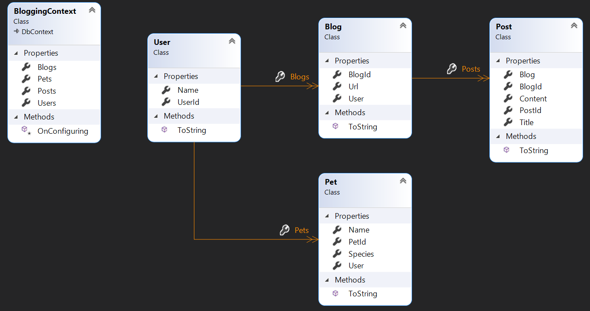
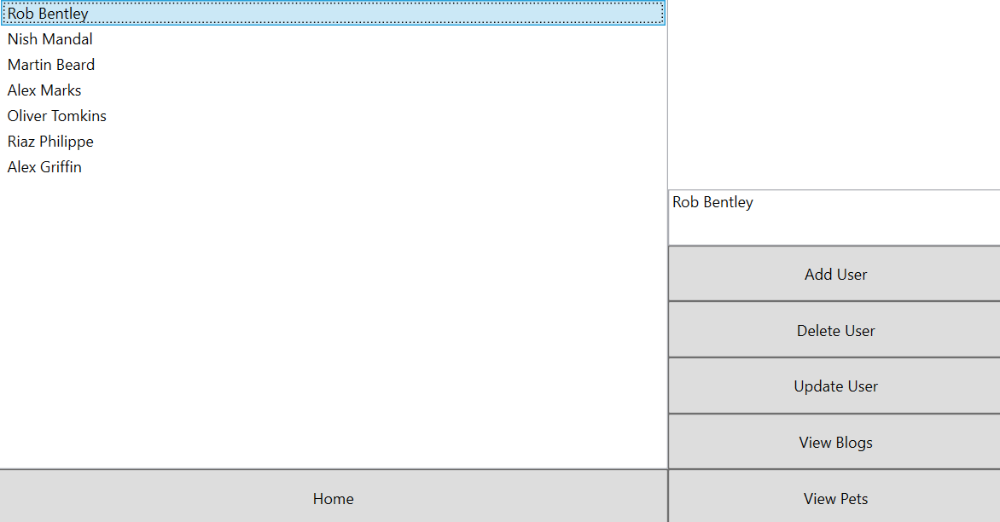

# Blogging Project
 ## Introduction
 This app enables users to create blogging sites and add posts to their sites.
 ## Structure
 The structure of the app is presented in the following diagram:

Each user can have blogs and each of those blogs can have posts. The posts can be provided with a title and content.
## Using the app
Users can be selected and you may view their pets or their blogs as shown in the following screenshot:

Additionally, updates can be made to the user (changing their name or deleting them. Deleting a user will trigger the deletion of all of their blogs, pets and posts.
